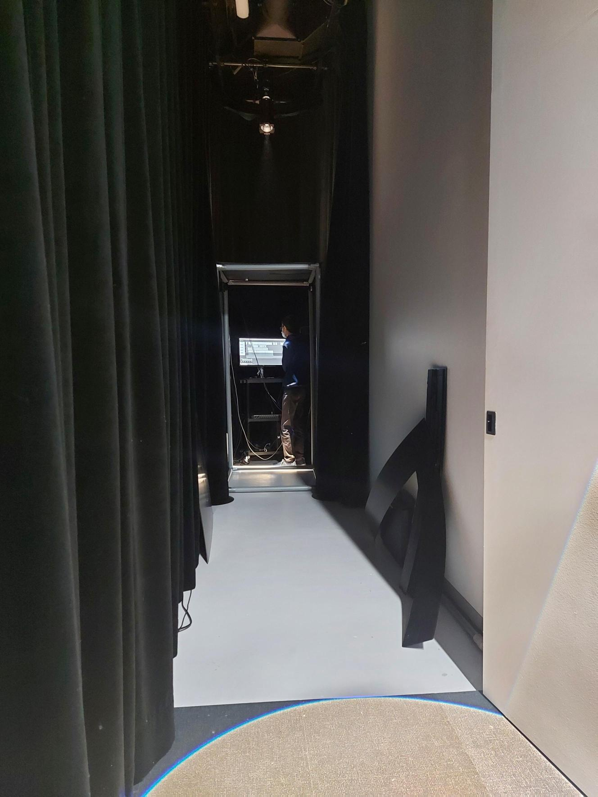
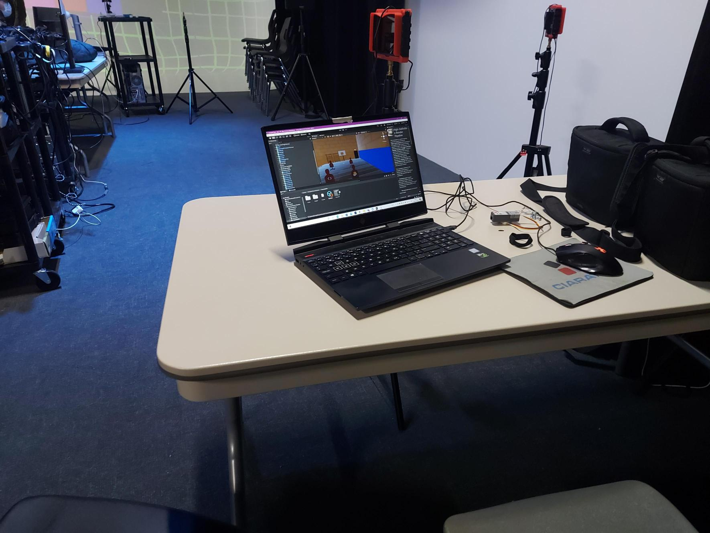
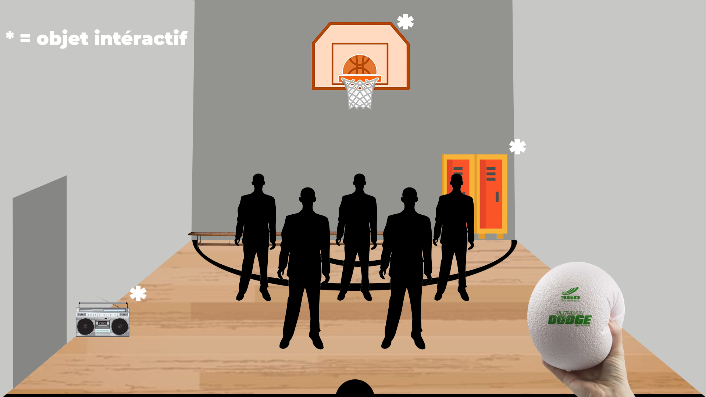

### Titre
* 3 minutes

### Créateurs / Créatrices
* Naoufal Bensaiad
* Jérémie Lévesque
* Samuel Poulin

### Thème du temps exploité dans l'oeuvre
* Le temps est représenté de façon à ce que l'intereacteur.trice ressente le temps différement, selon le point de vue d'un élève qui joue au ballon chasseur et qui s'amuse et un élève qui se fait intimider et qui est coincé dans un casier et qui doit attendre qu'on viennent l'aider

### Installation en cour de l'oeuvre dans les studios (photos)
Couloir
 

 

Ordinateur
 

 

Vue dans le casque de réalité virtuelle
 

Source : "https://tim-montmorency.com/2022/projets/3-minutes/docs/web/preproduction.html"

### Schéma de l'installation prévue (schéma de plantation + source)

Source : "https://tim-montmorency.com/2022/projets/3-minutes/docs/web/preproduction.html"

### Rôle de l'interacteur.trice
L'intéracteur.trice porte un casque vr et d'un bord celui-ci va prendre la place d'un élève qui va jouer au ballon chasseur. Ensuite ce dernier va ce mettre dans un casier, toujours avec un casque vr, et va regarder les autres élèves jouer pendant qu'il sera coincer dans un casier isoler, a part des autres. En autre, le rôle de l'interacteur.trice est indispensable dans le projet, puisque ce dernier doit porter le casque vr afin de voir et expérimenter a 100% le projet

### 3 cours nécessaires du programme pour réaliser l'oeuvre
* Réalité virtuelle
* Animation 3D
* Programmation interactive et bases de données

Réalité virtuelle : Le projet se retrouve en majorité en vr et l'interacteur.trice se retrouve à mettre un casque vr afin d'expérimenter ce projet à son plein potentiel, donc le cours de réalité virtuelle est évidement crutial pour ce projet.

Animation 3D : malgré qu'il n'est pas impossible d'utiliser du 2D dans la réalité virtuel, le but du vr est de rendre l'immersion de l'utilisateur le plus réelle possible, donc inclure de l'animation 3D dans le vr est effectivement nécessaire pour ce projet

Programmation interactive et bases de données : ce cours permet à l'élève, à travers la programmation, de controler l'interactivité des animations créer par ce dernier. Ce cours couvre la programmation et les bases de données, qui aide énormément à ajouter de l'intéractivité a l'animation 3D et à rendre la réalité virtuelle fonctionelle.
