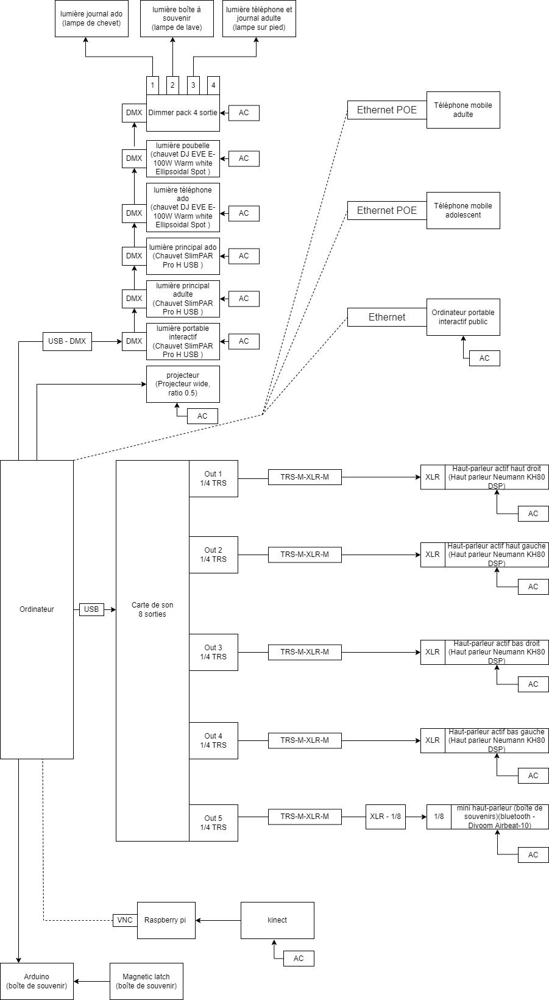

### Titre
* Chère Sasha

### Créateurs / Créatrices
* Trish Nguyen
* Angelina De Silva Jeca
* Karine Cormier
* SabrinaSabrina Kayani

### Thème du temps exploité dans l'oeuvre
* Le temps est exploité par les deux vie de Sasha 

### Installation en cours de l'oeuvre dans les studios (photos)

### Schéma de l'installation prévue (schéma de plantation + source)

Budget:

Equipement:

Plantation:

Scenarimage:

Brouillon du timeline:

Source: https://tim-montmorency.com/2022/projets/Chere-Sasha/docs/web/index.html et https://tim-montmorency.com/2022/projets/Chere-Sasha/docs/web/preproduction.html

### Rôle de l'interacteur.trice
Le Rôle de l'interacteur.trice est de découvrir que les deux vies projetées devant eux sont différents passages de la vie de la même personne.

### 3 cours nécessaires du programme pour réaliser l'oeuvre
** --
