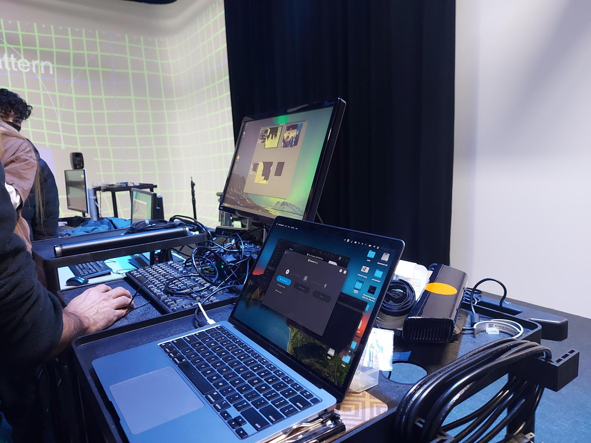
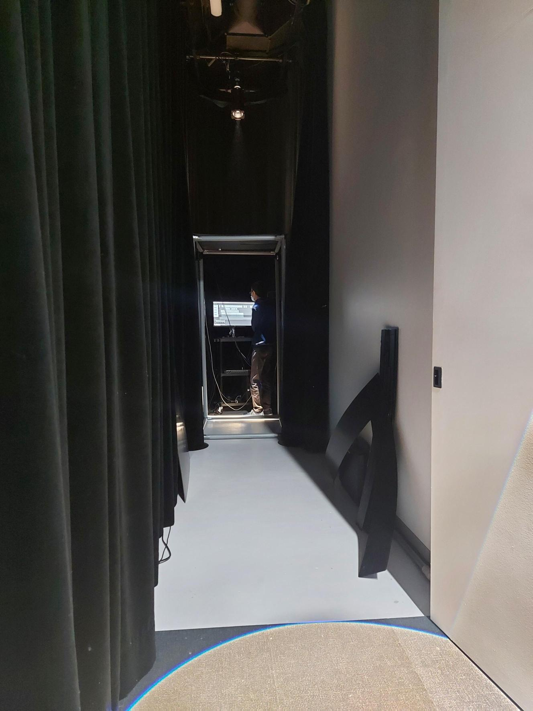
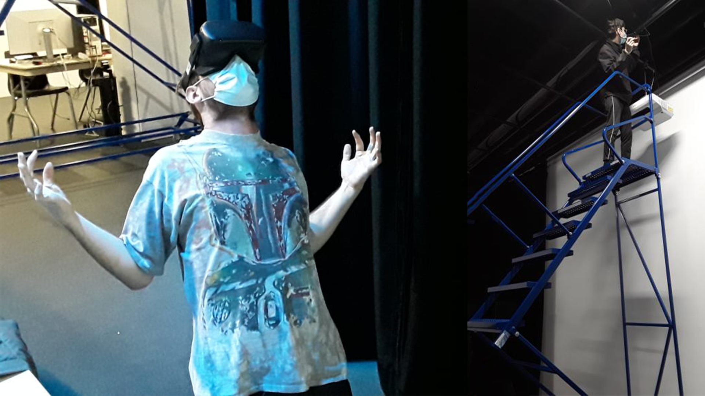
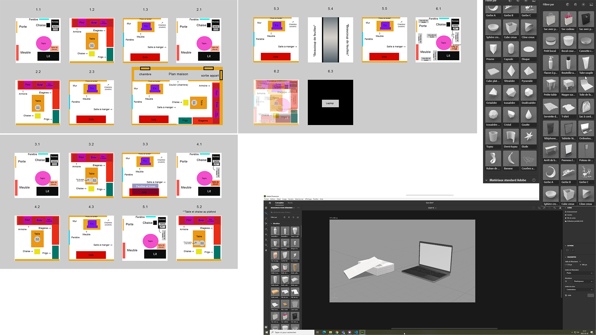

### Titre
* Distorsion collective

### Créateurs / Créatrices
* William Dubois
* Ghislain Lacombe

### Thème du temps exploité dans l'oeuvre
* Le thème du temps est exploité en montrant les travaux qui s'empilent de plus en plus.
* L'ambiance qui change quand les élèves devienne de plus en plus isoler.

### Installation en cours de l'oeuvre dans les studios (photos)
Bureau de travail:

Endroit principal:

Installation projecteur:

### Schéma de l'installation prévue (schéma de plantation + source)

Schéma de branchement:

Plan technique:

Source :
https://tim-montmorency.com/2022/projets/Distorsion-collective/docs/web/index.html

### Rôle de l'interacteur.trice
Le role de l'interacteur/trice est de ressentir l'isolation de la pandémie pour ensuite comprendre l'empleure de l'impact imposer sur les élèves concernés.

### 3 cours nécessaires du programme pour réaliser l'oeuvre
* Programmation interactive et bases de données
* Programmation serveur Web
* Optimisation Web
