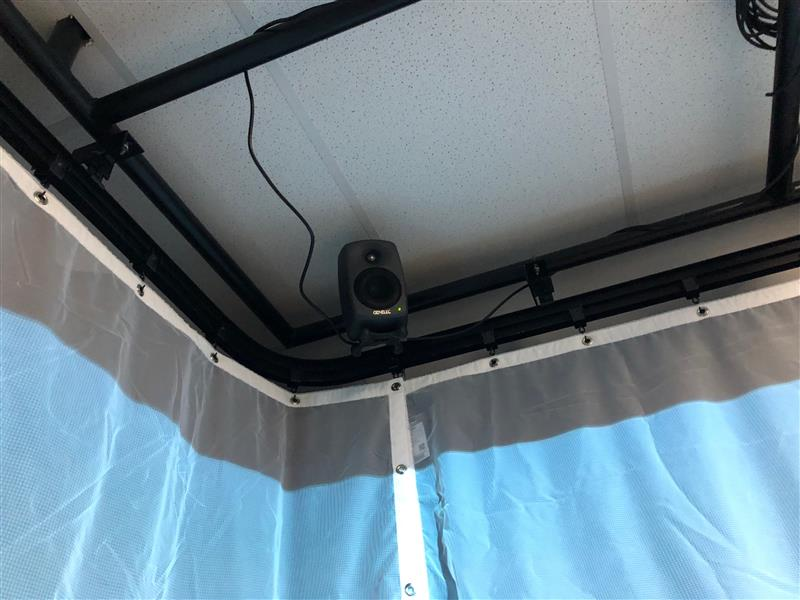
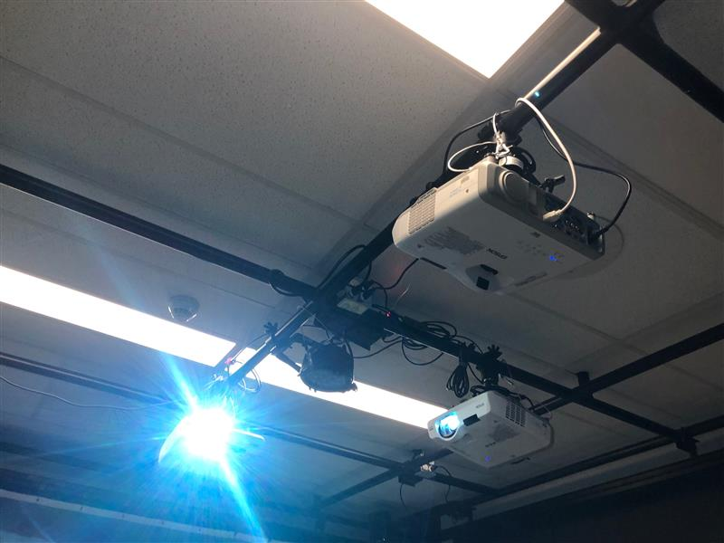
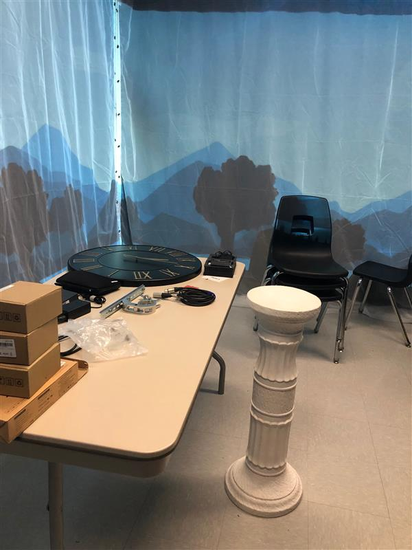
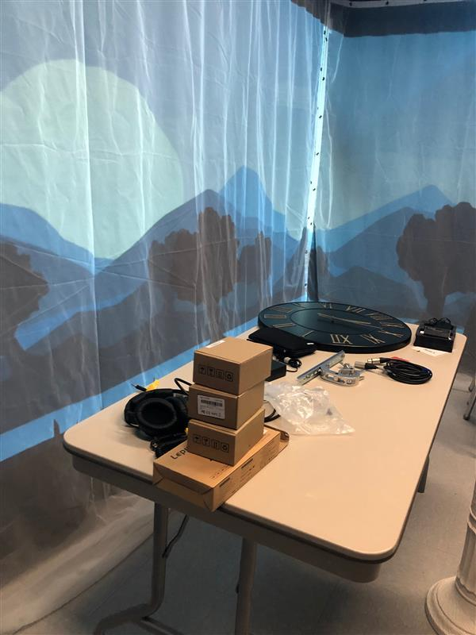
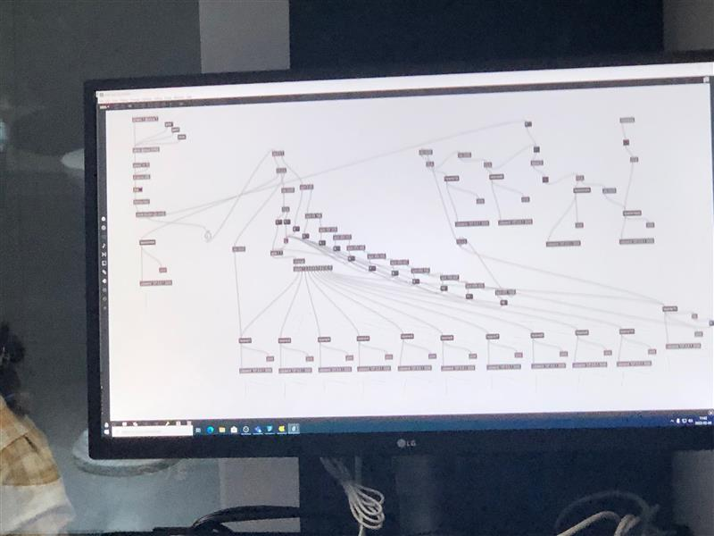
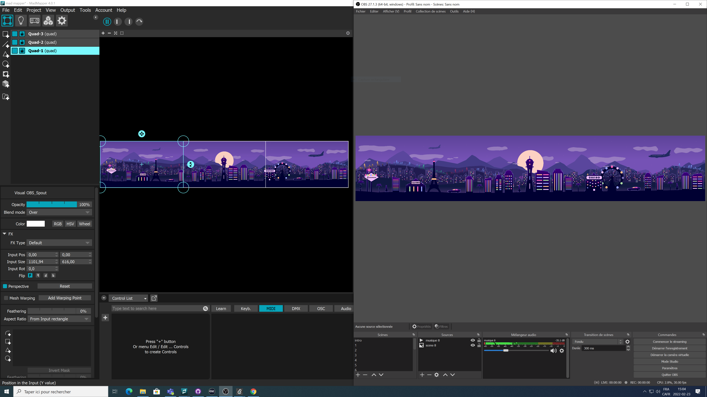

### Titre
* Horloge de l'apocalypse

### Créateurs / Créatrices
* Maxime Sabourin
* Louis-Philippe Gravel
* Alexis Lacasse
* Tristan Girard-Montpetit
* Maxime De Falco

### Thème du temps exploité dans l'oeuvre
* Cette oeuvre explore le thème du temps à travers une horloge.
* Chaque position de la grande aiguille change la scène environnante (celle qui est projétée sur les toiles).
* Les scènes ainsi que l'avancement dans le temps représente l'impact humain sur les sphères sociopolitiques et environnementales du monde. 
* Le concept est tiré d'une horloge conceptualisée durant la guerre froide. Justement nommée « L'horloge de la fin du monde », elle représenterait (hypothétiquement) le temps restant avant la fin du monde. 
* Les créateurs de ce projet ont décidé de représenter dans chaque scène une sorte d'évolution, celle de l'être humain au fil de l'histoire. 
* Chaque fois que l'aiguille avance, les scènes audiovisuelles deviennent de plus en plus cauchemardesques/dystopiques pour ensuite finir sur une scène qui semblerait représenter une version de l'enfer. 

### Installation en cours de l'oeuvre dans les studios (photos)

**Haut-parleurs avec toile**  
 
 
**Projecteur**  
  
 
**Colonne + Horloge**  
 
 
**Projections**  
 
 
**Logiciel Max8**  
 
 
**OBS + MadMapper** (source: https://tim-montmorency.com/2022/projets/L-horloge-de-l-apocalypse/docs/web/index.html)  
 

### Schéma de l'installation prévue (source: https://tim-montmorency.com/2022/projets/L-horloge-de-l-apocalypse/docs/web/index.html)  
 

### Rôle de l'interacteur.trice
--
* L'intéracteur fait tourner la grande aiguille de l'horloge pour faire avancer le temps et en conséquent changer les scènes.
* À la fin il doit répondre au téléphone aussi. 

### 3 cours nécessaires du programme pour réaliser l'oeuvre
--
* Animation 2D
* Conception Sonore
* Programmation interactive et base de données
