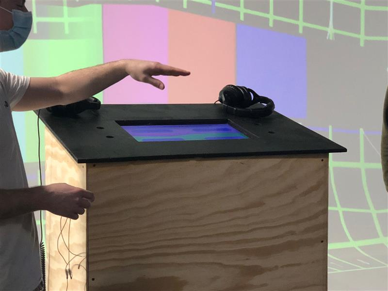
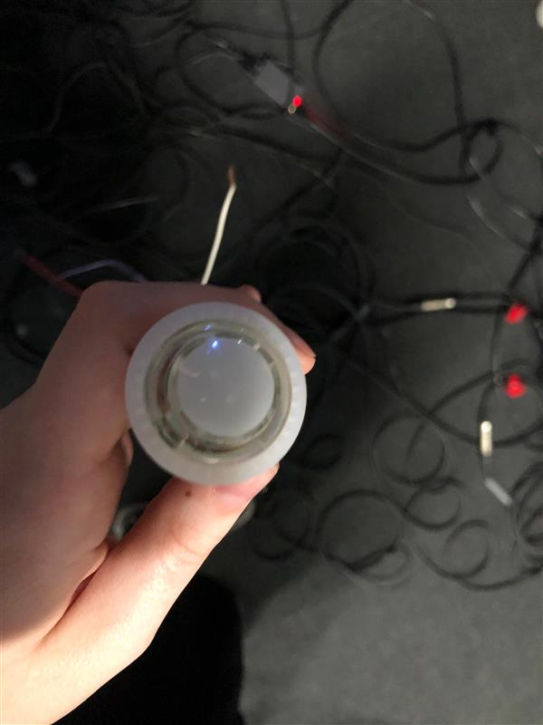
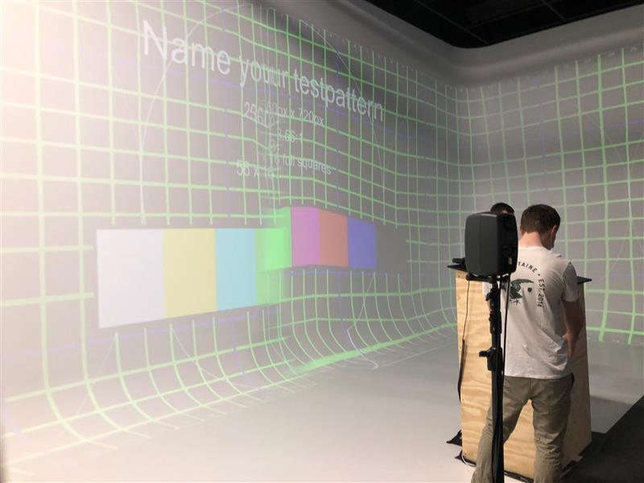
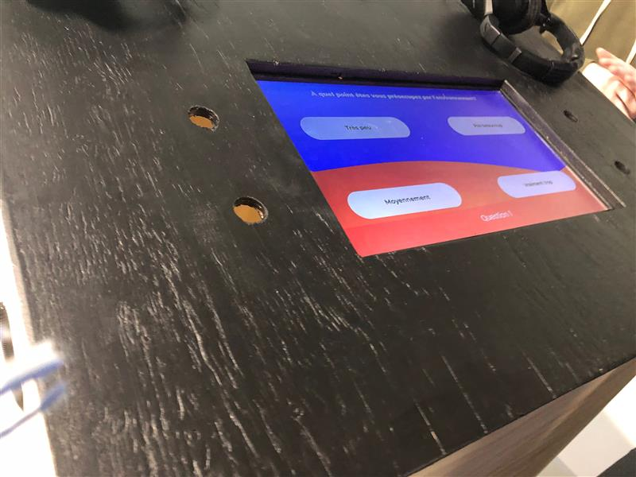

### Titre
* Jeu Temporel

### Créateurs / Créatrices
* Raphaël Fillion
* Philipe Trudel

### Thème du temps exploité dans l'oeuvre
* Cette oeuvre explore le thème du temps à travers les effets qu'a eus l'être humain sur l'environnement. Plus spécifiquement la pollution que l'humain a causée au fil du temps. 
* Le concept de cette installation est exécuté à travers un jeu-questionnaire. 
* Le jeu est projeté sur les murs du studio et un podium est placé devant, c'est l'élément qui donne la possibilité d'interactivité. 

### Installation en cour de l'oeuvre dans les studios (photos)
**Podium intéractif**  

**Bouton**  

**Projection**  

**Questionnaire**  

### Schéma de l'installation prévue (schéma de plantation + source)

### Rôle de l'interacteur.trice
* L'intéracteur doit répondre à des questions concernant l'environnement et dépendamment des résultats qu'il choisit, des fins différentes l'attendent. 
* Il peut répondre à travers le podium qui est muni de 4 boutons ainsi qu'un écran où s'affichent les choix de réponses. 

### 3 cours nécessaires du programme pour réaliser l'oeuvre
* Introduction à la production multimédia
* Intégration Web
* Programmation intéractive
